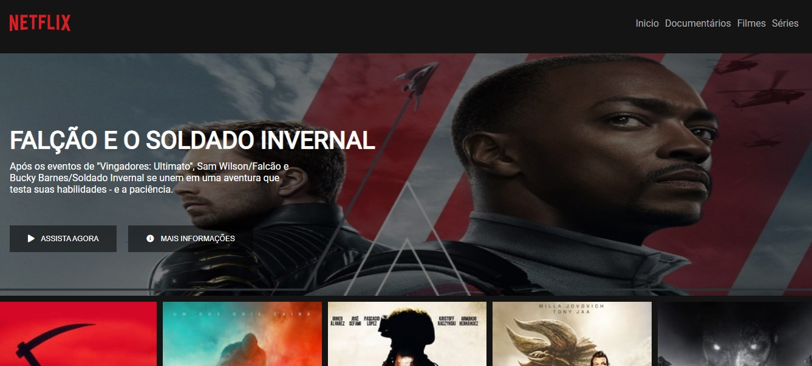
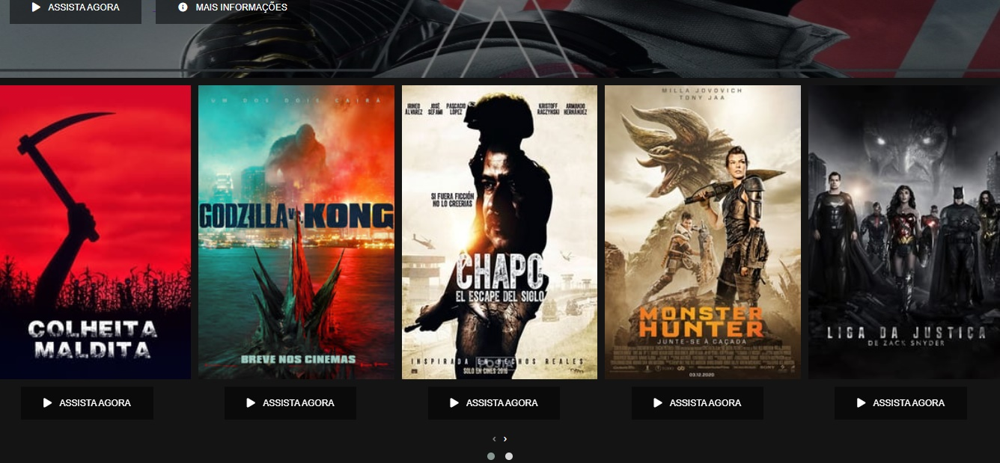
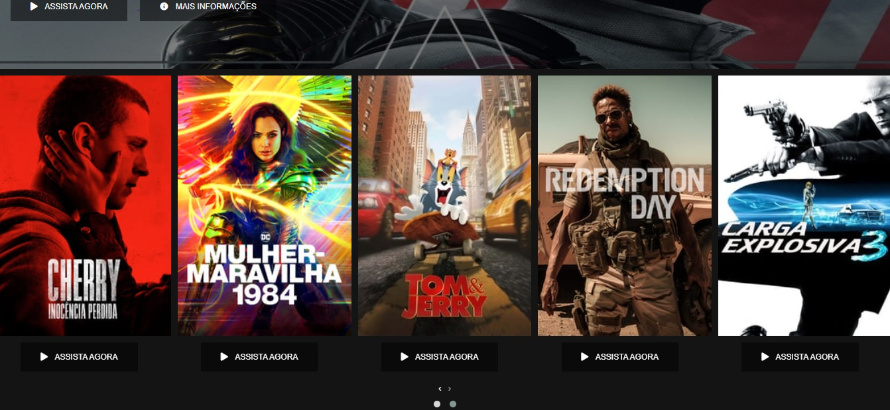
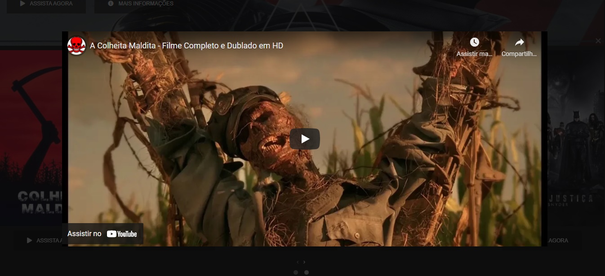

# Um projeto desenvolvido através do Bootcamp proposto pela Digital Innovation One.
**A aplicação é um Clone da Interface do Site da Netflix.**

## Funções Inseridas
- A aplicação foi inserido algumas funções extras sendo:
- Favicon para a barra do navegador com a logo da Netflix.
- Logo da Netflix em formato SVG ao invés de texto.
- Iframe em formato de popup para o usuário assistir o filme na própria tela ao clicar no botão.

## Demonstração

## 🚀 Tecnologias utilizadas

O projeto foi desenvolvido utilizando as seguintes tecnologias

- [HTML]
- [CSS]
- [JS]
- [JQUERY]

# Autor

**Isaac Matos**

# Encontre-me nas redes sociais:
- 🌍 [Linkedin](https://www.linkedin.com/in/isaac-matos-568b6911a/)
- 🌍 [Twitter](https://twitter.com/ic_matos)
